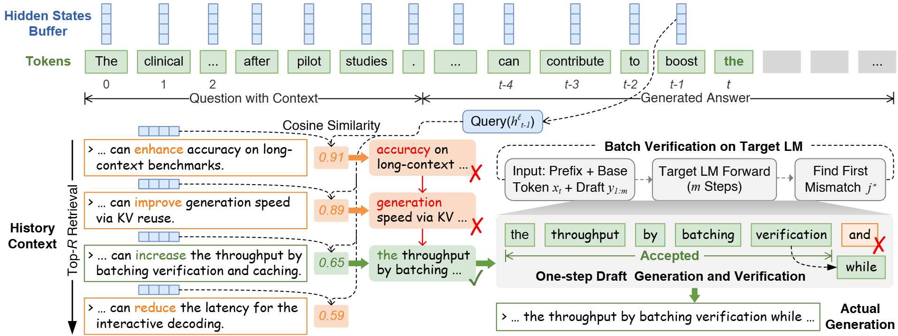
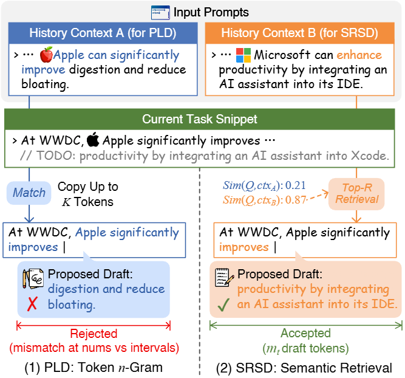

# SRSD

**Semantic Retrieval Speculative Decoding** is a **training-free** decoding acceleration method that reuses a target LLM's intermediate-layer hidden states as an in-context semantic index.

SRSD achieves significant speedups (1.5–3× on long-context tasks) without requiring additional models or fine-tuning, making it a cost-effective solution for accelerating LLM inference.

---

## System Overview



### Method

SRSD introduces a novel **training-free** speculative decoding approach that exploits the semantic structure inherent in transformer intermediate representations. Unlike traditional speculative decoding methods that require draft models or fine-tuning, SRSD reuses the target model's own hidden states as a semantic cache.

**Core Mechanism:**

1. **Semantic Indexing During Prefill**: During the initial prefill phase, SRSD extracts and indexes hidden states from intermediate layers of the transformer. These representations capture rich semantic information about the input context.

2. **Layer-Wise Retrieval**: For each decoding step, SRSD retrieves the top-k most semantically similar cached hidden states from the index using cosine similarity. The optimal retrieval layer is determined via offline profiling and stored in pre-computed mapping files.

3. **Speculation via Cached States**: Retrieved semantic neighbors are used to predict likely continuations, enabling the model to speculate multiple tokens ahead without requiring a separate draft model.

4. **Verification and Acceptance**: The target model verifies speculated tokens in parallel, accepting valid predictions and rolling back when necessary, ensuring output correctness.

**Key Advantages:**

- **Zero Training Cost**: No additional training, fine-tuning, or model modifications required
- **Memory Efficient**: Reuses existing hidden states without storing separate draft model weights
- **Adaptive**: Works across different model families (Qwen, Llama, Mistral) and sizes
- **Performance**: Achieves 1.5–3× speedup on long-context code generation tasks

---

## Requirements

### System Dependencies

Ensure you have the following prerequisites:
- Python 3.8+
- CUDA-capable GPU(s)
- Git (for cloning submodules)
- CMake (for llama.cpp compilation)
- C++ compiler (GCC/Clang/MSVC)

### Step 0: Install Dependencies (llama.cpp and EAGLE)

This project uses llama.cpp for GGUF model support and EAGLE-3 for baseline comparisons.

#### Install llama.cpp

```bash
# Clone and checkout specific version
git clone https://github.com/ggerganov/llama.cpp.git 
cd llama.cpp
git checkout 22577583a38ec0d236e6b4d45357c5e79021da07

# Build with CUDA support (recommended)
cmake -B build -DGGML_CUDA=ON
cmake --build build --config Release

# Or build with CPU only
# make

cd ..
```

#### Install EAGLE-3

```bash
# Clone and checkout specific version
git clone https://github.com/SafeAILab/EAGLE.git EAGLE
cd EAGLE
git checkout 791597abcf8d61245ea0784d94c518acc4a5814b

# Install EAGLE package
pip install -e .

# Or install requirements only
# pip install -r requirements.txt

cd ..
```

**Tested Versions:**
- **EAGLE**: commit `791597abcf8d61245ea0784d94c518acc4a5814b` (short: `791597a`)
- **llama.cpp**: commit `22577583a38ec0d236e6b4d45357c5e79021da07` (short: `b7312`)

For EAGLE-3 pre-trained weights, see [EAGLE README](https://github.com/SafeAILab/EAGLE#eagle-3-weights).

### Step 1: Install Python Dependencies

```bash
pip install -r requirements.txt
```

Key dependencies include:
- PyTorch (with CUDA support)
- Transformers
- Additional NLP libraries (see `requirements.txt` for full list)


---

## Usage

### Option 1: Quick Start with eval.sh (Recommended)

The `eval.sh` script provides a convenient wrapper to run experiments with predefined configurations:

```bash
# 1) Quick sanity check (fast, small samples)
bash eval.sh --quick --which baselines --tasks code_edit

# 2) Run specific model experiments
bash eval.sh --paper --which llama --decode greedy
bash eval.sh --paper --which qwen7b --decode greedy
bash eval.sh --paper --which mistral --decode greedy

# 3) Run all models (comprehensive evaluation)
bash eval.sh --paper --which all --decode greedy
```

**Available options:**
- `--quick` or `--paper`: Quick test (5 samples) vs full paper evaluation (200 samples)
- `--which`: Choose model set (`baselines`, `llama`, `qwen7b`, `qwen14b`, `mistral`, `all`)
- `--decode`: Decoding strategy (`greedy` or `sample`)
- `--tasks`: Task selection (`all`, `code_edit`, etc.)
- `--samples N`: Override number of samples per task

The script automatically handles logging, output directories, and parameter management.

---

### Option 2: Direct Python Commands

For fine-grained control, you can directly invoke the `auto_bench.py` scripts:

#### Llama-3.1-8B with SRSD

```bash
python Qwen/auto_bench.py \
  --tasks all \
  --samples-per-task 200 \
  --max-new-tokens 2048 \
  --model-path models/LLM-Research/Meta-Llama-3.1-8B-Instruct \
  --lookahead-enable \
  --lookahead-gguf-model models/gguf/model-q4_k_m.gguf \
  --sem-layer-mapping Qwen/map/best_layer_La_greedy.json \
  --sem-retrieval-topk 10 \
  --assisted-target-model models/LLM-Research/Meta-Llama-3.1-8B-Instruct \
  --assisted-draft-model models/LLM-Research/Meta-Llama-3.2-1B-Instruct \
  --out-dir outputs/llama_greedy/result
```

#### Qwen2.5-7B with SRSD

```bash
python Qwen/auto_bench1.py \
  --tasks all \
  --samples-per-task 200 \
  --max-new-tokens 2048 \
  --model-path models/Qwen2.5-7B-Instruct \
  --sem-layer-mapping Qwen/map/best_layer_Qw_7B_greedy.json \
  --sem-retrieval-topk 10 \
  --out-dir outputs/qwen7b_greedy/result
```

#### Qwen2.5-14B with SRSD

```bash
python Qwen/auto_bench.py \
  --tasks all \
  --samples-per-task 200 \
  --max-new-tokens 2048 \
  --model-path models/Qwen2.5-14B-Instruct \
  --sem-layer-mapping Qwen/map/best_layer_Qw_14B_greedy.json \
  --sem-retrieval-topk 10 \
  --assisted-target-model models/Qwen2.5-14B-Instruct \
  --assisted-draft-model models/Qwen2.5-0.5B-Instruct \
  --out-dir outputs/qwen14b_greedy/result
```

#### Mistral-Small-3.1-24B with SRSD

```bash
python Mistral/auto_bench.py \
  --tasks all \
  --samples-per-task 200 \
  --max-new-tokens 2048 \
  --model-path models/Mistral-Small-3.1-24B-Instruct-2503 \
  --sem-layer-mapping Mistral/map/best_layer_Mis_greedy.json \
  --sem-retrieval-topk 10 \
  --out-dir outputs/mistral_greedy/result
```

#### Sampling Mode

For sampling-based decoding, add the following flags:

```bash
--do-sample --temperature 0.8 --top_p 0.9 --top_k 0
```

And use the corresponding sampling layer mappings (e.g., `best_layer_Qw_7B_sample.json`).

---

### Baseline Comparisons

Run baseline methods (AR, PLD) for comparison:

```bash
# Autoregressive baseline (AR)
python Qwen/run_pld.py \
  --model-path models/Qwen2.5-7B-Instruct \
  --tasks code_edit \
  --samples-per-task 80 \
  --max-new-tokens 2048 \
  --n-gram 0 \
  --K 0 \
  --output outputs/baselines/AR_greedy.jsonl

# PLD baseline
python Qwen/run_pld.py \
  --model-path models/Qwen2.5-7B-Instruct \
  --tasks code_edit \
  --samples-per-task 80 \
  --max-new-tokens 2048 \
  --n-gram 4 \
  --K 16 \
  --output outputs/baselines/pld_greedy.jsonl
```

---

## Example Results



The figure above shows example outputs and performance comparisons across different methods on code editing tasks.

---

## Project Structure

```
.
├── Qwen/                    # Qwen model implementations
│   ├── auto_bench.py       # Main evaluation script (Qwen 14B)
│   ├── auto_bench1.py      # Evaluation script (Qwen 7B)
│   ├── run_pld.py          # PLD baseline
│   ├── run_semantic.py     # Semantic baseline
│   └── map/                # Layer mappings for semantic retrieval
├── Mistral/                # Mistral model implementations
│   ├── auto_bench.py       # Mistral evaluation script
│   └── map/                # Layer mappings
├── EAGLE/                  # EAGLE-related utilities
├── eval.sh                 # Unified evaluation wrapper script
├── requirements.txt        # Python dependencies
└── README.md              # This file
```

---

## Output Directory Structure

Results are saved to `outputs/` by default:

```
outputs/
├── La_greedy/              # Llama greedy results
├── Qw_7B_greedy/          # Qwen 7B greedy results
├── Qw_14B_greedy/         # Qwen 14B greedy results
├── Mis_greedy/            # Mistral greedy results
├── baselines_qwen7b_code_edit/  # Baseline comparisons
└── eval_*.log             # Execution logs
```

Each experiment directory contains:
- `result/`: JSON files with generated outputs and metrics
- Performance statistics and timing information

---

## Environment Variables

You can customize model paths and configurations via environment variables before running `eval.sh`:

```bash
export QWEN7B_PATH="path/to/Qwen2.5-7B-Instruct"
export QWEN14B_PATH="path/to/Qwen2.5-14B-Instruct"
export LLAMA31_8B_PATH="path/to/Meta-Llama-3.1-8B-Instruct"
export MISTRAL24B_PATH="path/to/Mistral-Small-3.1-24B-Instruct-2503"
export OUT_ROOT="./my_outputs"

bash eval.sh --paper --which all
```

---

## Notes

- **Model Downloads**: Ensure all required models are downloaded before running experiments
- **GPU Memory**: Large models (14B, 24B) require substantial GPU memory
- **Layer Mappings**: Pre-computed optimal layer mappings are provided in `*/map/` directories
- **Reproducibility**: Use `--decode greedy` for deterministic results; use `--decode sample` for diverse outputs

---

## License

This code is provided for research purposes. Refer to individual model licenses for usage restrictions.
